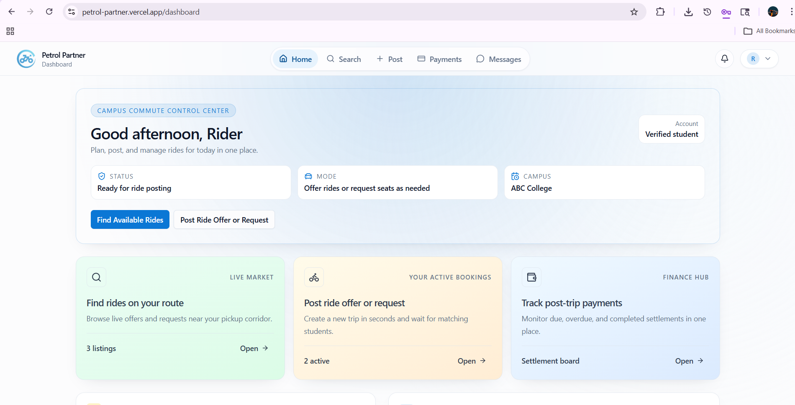
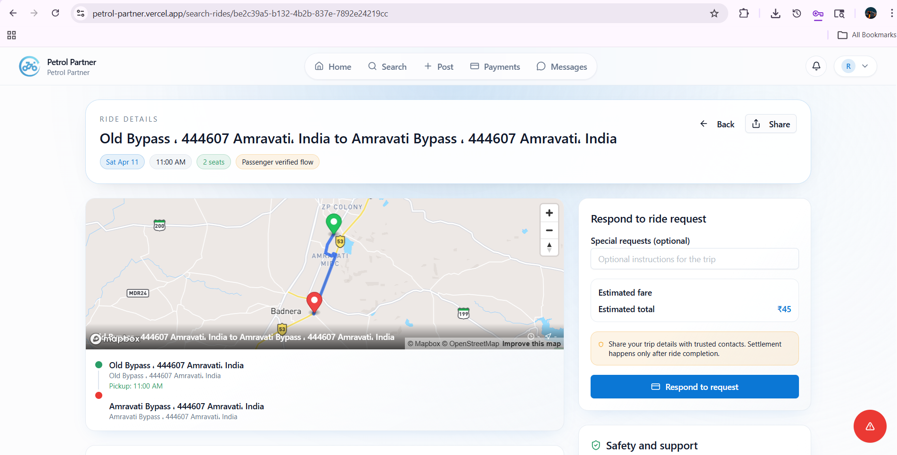
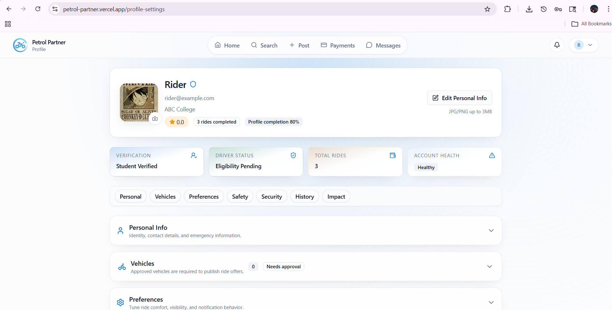

# Petrol Partner

**Petrol Partner** is a student-only intercity ride-sharing platform built as a final-year major project.
It helps college students share private-vehicle trips safely, reduce travel cost, and improve seat utilization through verified, route-based matching.

  
  
  

## Vision

Build the mobility layer for students: trusted, affordable, and operationally reliable.

Students should not choose between expensive solo travel and unsafe alternatives. Petrol Partner creates a campus-verified transport network where any verified user can become:

- A ride giver (post a ride offer)
- A ride taker (post a ride request)

## Problem We Solve

- Empty seats in student-owned vehicles on intercity routes
- Fragmented coordination through informal groups/chats
- Limited trust and payment accountability in peer-to-peer travel

## Product Highlights

- Student-first verification and eligibility controls
- Unified posting flow for both ride offers and ride requests
- Route-based discovery and asynchronous matching signals
- End-to-end booking lifecycle: request -> confirm -> complete
- Settlement lifecycle with due/overdue handling and financial hold protection
- Post-trip online settlement using Razorpay with webhook-driven finality
- Queue-backed backend processing for durable, production-style execution

## Trust and Safety Model

- Only verified students can access transaction flows
- Ride offers require approved driver eligibility and approved vehicle
- Gender preference controls supported at ride-posting level
- Financial discipline enforced through overdue settlement hold rules
- Payment final state is decided by reconcile/webhook, not client callback

## System Architecture

Monorepo services:

- `web` -> Next.js frontend
- `apps/api` -> Express + TypeScript domain API
- `apps/worker` -> BullMQ worker for reconcile/scheduler/background jobs

Core stack:

- Next.js (App Router)
- Node.js + Express
- Supabase Postgres
- Redis + BullMQ
- Razorpay
- Mapbox
- Deploy model: Vercel (`web`) + Render (`apps/api`, `apps/worker`)

## Current Scope

Implemented and actively integrated:

- Authentication and session flows
- Verification domain
- Rides (offer + request)
- Bookings
- Settlements
- Payments (post-trip online settlement path)

Planned roadmap items:

- Real-time chat runtime
- Live trip tracking runtime
- Push notification delivery
- Advanced trust graph and safety tooling

## Business Direction

Petrol Partner is being developed as a startup-ready foundation, not only an academic prototype.
The long-term direction is to expand from campus-level usage to regional student travel corridors with stronger trust infrastructure, better routing intelligence, and sustainable platform revenue models.

## Project Context

This project is developed as a final-year major project and serves as the baseline product for a future student mobility startup.
